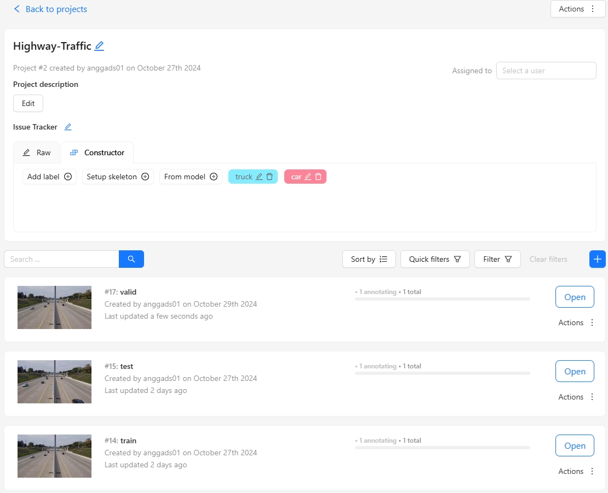

# CVAT-Setup-Directory-Helper
So I made this repo because, I have difficulty managing the number of frames extracted from CVAT (Computer Vision Annotation Tool), which when the input is Video, the default frame taken is 30 fps (probably?), while what is needed is not always that much, and also related to splitting data, I don't think CVAT has that feature yet, so that's why I made this repo.

# How to run?

## **Step 1 Clone the repository in your working directory**
```bash
git clone https://github.com/AnggaDS01/CVAT-Setup-Directory-Helper.git
```

```bash
cd CVAT-Setup-Directory-Helper
```

## **Step 2 Create a virtual environment after opening the repository**
Here I am using python version 3.11.10, make sure the python version you are using is 3.10+, in creating a virtual environment you can use [Anaconda](https://www.anaconda.com/download/success) or [Miniconda](https://docs.anaconda.com/miniconda/), here I use Miniconda version 24.9.2, to create it you can type the following command:

### **Step 2.1 Create a virtual environment using the conda prompt**
```bash
# conda create -n <directory_name> python=<python_version> ipython
conda create -n "myenv" python=3.11.10 ipython
```

#### **Step 2.1.1 Activate the virtual environment**

```bash
# To activate this environment, use
#
#     $ conda activate myenv
#
# To deactivate an active environment, use
#
#     $ conda deactivate
```

when you attempt to type the command `conda activate myenv`

```bash 
conda activate myenv
```

and get an error like this:

Output:
```bash
CondaError: Run 'conda init' before 'conda activate'
```

> **Note: Please restart your shell and open it again in your shell, then your conda will be activated.**

### **Step 2.2 Create a virtual environment using the venv module**
```bash
# python -m venv <directory>
python -m venv myenv
```

#### **Step 2.2.1 Windows venv activation**
To activate your venv on Windows, you need to run a script that gets installed by venv. If you created your venv in a directory called `myvenv`, the command would be:

```bash
# In cmd.exe
myenv\Scripts\activate.bat
# In PowerShell
myenv\Scripts\Activate.ps1
```

#### **Step 2.2.2 Linux and MacOS venv activation**
On Linux and MacOS, we activate our virtual environment with the source command. If you created your venv in the `myvenv` directory, the command would be:

```bash
$ source myvenv/bin/activate
```

## **Step 3 Install the requirements**

```bash
pip install -r requirements.txt
```

## **Step 4 Directory Structure Reading**
So in the Data Zone directory **(Warning: Do Not Delete This Directory)**, is the place to store images or videos. I will use the following structure as an example:

```
CVAT-Setup-Directory-Helper
├── Data Zone
│   ├── Annotated-Images-Assets [IF YOU HAVE IMAGES PUT THEM HERE]
│   │   ├── Highway-Traffic [OUTPUT FOR VIDEO CASE]
│   │   │   └── HT_00001
|   |   |       ├── data_train
|   |   |       |   ├── images
|   |   |       |   |   ├── HT_00001_00000.jpg
|   |   |       |   |   ├── HT_00001_00003.jpg
|   |   |       |   |   ├── ...
|   |   |       |   └── labels
|   |   |       |   |   ├── HT_00001_00000.txt
|   |   |       |   |   ├── HT_00001_00003.txt
|   |   |       |   |   ├── ...
|   |   |       ├── data_test
|   |   |       └── data_valid
│   │   └── Highway-Traffic-02 [LET'S SAY YOU PUT YOUR IMAGES IN THIS FOLDER]
|   |       ├── HT_00001_00000.jpg
|   |       ├── HT_00001_00001.jpg
|   |       ├── ...
│   └── Videos-Assets [IF YOU HAVE A VIDEO PUT IT HERE]
│       └── Highway-Traffic
│           └── HT_00001
|               └── 4K Video of Highway Traffic! (online-video-cutter.com).mp4
```

### **Step 4.1 Annotated-Images-Assets**
For the **Annotated-Images-Assets** directory, it is a place to store images and output from video extraction, so if you have an image dataset then put it in the **Annotated-Images-Assets** directory. for images can be stored in a nested folder, for example:

```
│   ├── Annotated-Images-Assets 
│   │   └── Highway-Traffic-02
|   |       └── HT_00001
|   |           ├── HT_00001_00000.jpg
|   |           ├── HT_00001_00001.jpg
|   |           ├── ...
```

So this is useful when you have a project, where there are dataset categories that need to be labeled, for example

```
│   ├── Annotated-Images-Assets 
│   │   └── License-Plate
|   |       ├── Indonesia
|   |       |   ├── idn_00000.jpg
|   |       |   ├── idn_00001.jpg
|   |       |   ├── ...
|   |       ├── Thailand
|   |       |   ├── th_00000.jpg
|   |       |   ├── th_00001.jpg
|   |       |   ├── ...
|   |       └── Malaysia
|   |           ├── my_00000.jpg
|   |           ├── my_00001.jpg
|   |           ├── ...
```

> **Note:** It should be noted that subfolder creation cannot be done automatically in this program, so it needs to be made manually, this program can only be used for splitting data and extracting videos into images, in the future I want to make it in the form of a GUI so that it is easier to organize the dataset.
 
### **Step 4.2 Videos-Assets**
Similarly to Annotated-Images-Assets, with Videos-Assets, you put your videos in this folder.

```
│   └── Videos-Assets
│       └── Highway-Traffic
│           └── HT_00001
|               └── 4K Video of Highway Traffic! (online-video-cutter.com).mp4
```

and of course you can store your videos in nested folders. and this is an example of the output of the video process:

```
│   ├── Annotated-Images-Assets 
│   │   ├── Highway-Traffic
│   │   │   └── HT_00001
|   |   |       ├── data_train
|   |   |       |   ├── images
|   |   |       |   |   ├── HT_00001_00000.jpg
|   |   |       |   |   ├── HT_00001_00003.jpg
|   |   |       |   |   ├── ...
|   |   |       |   └── labels
|   |   |       |   |   ├── HT_00001_00000.txt
|   |   |       |   |   ├── HT_00001_00003.txt
|   |   |       |   |   ├── ...
|   |   |       ├── data_test
|   |   |       |   ├── images
|   |   |       |   |   ├── HT_00001_00002.jpg
|   |   |       |   |   ├── HT_00001_00011.jpg
|   |   |       |   |   ├── ...
|   |   |       |   └── labels
|   |   |       |   |   ├── HT_00001_00002.txt
|   |   |       |   |   ├── HT_00001_00011.txt
|   |   |       |   |   ├── ...
|   |   |       └── data_valid
|   |   |       |   ├── images
|   |   |       |   |   ├── HT_00001_00006.jpg
|   |   |       |   |   ├── HT_00001_00013.jpg
|   |   |       |   |   ├── ...
|   |   |       |   └── labels
|   |   |       |   |   ├── HT_00001_00006.txt
|   |   |       |   |   ├── HT_00001_00013.txt
|   |   |       |   |   ├── ...
```

## **Step 5 How the Program Works**
```
├── run_pipeline.py
├── control_panel.py
```

so in running this program you only focus on those two files

### **Step 5.1 run_pipeline.py**
This is the main file that runs the program. It takes in the control_panel.py file and runs the pipeline.

### **Step 5.2 control_panel.py**
The control_panel.py contains variables that are used to set the output of the video or image dataset that you have, for videos you can set how many FPS, then the image size, and the desired split ratio.

## **Step 6 Upload to CVAT**
After the directory has been set up, the processed image results can be directly uploaded to CVAT, you can create projects and specific tasks, for example for training, validation or test data, you can see a brief tutorial on creating projects in [CVAT](https://youtu.be/CGOBR5ZmIC0?si=ndb2QChr_YEopntS)



---

# Conclusion
This repository, CVAT-Setup-Directory-Helper, is designed to streamline dataset preparation for CVAT. By simplifying directory structuring, image extraction, and dataset splitting, this tool enables a more efficient workflow for creating training-ready data for computer vision tasks. It supports both image and video assets, offering flexible frame extraction, split configurations, and a user-friendly pipeline to enhance productivity.

With these configurations in place, users can save time on repetitive tasks and focus on enhancing their dataset quality, contributing to better model training and performance. For any project that involves organizing and preparing data for annotation, CVAT-Setup-Directory-Helper aims to be a reliable solution.